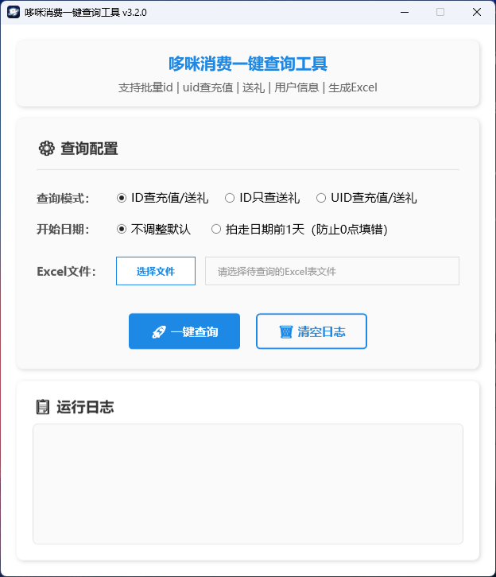

# 构建与发布

本仓库是一个基于 .NET 10 的 WPF 应用程序。使用附带的 `publish.ps1` 脚本可以生成一个体积较小的单文件、框架依赖的发布包，目标机器需要安装 Windows Desktop 运行时。

示例：

 - 发布 x64 Release（默认）：
   `./publish.ps1 -Runtime win-x64`

 - 启用 ReadyToRun 发布（可能增大体积）：
   `./publish.ps1 -Runtime win-x64 -EnableReadyToRun`

注意事项：
 - 发布为框架依赖模式（`SelfContained=false`），用户需在目标机器上安装对应的 Windows Desktop 运行时。
 - 默认启用裁剪（Trimming）以减小文件体积；裁剪可能会移除运行时所需的代码，请充分测试后再发布。

## 软件界面

