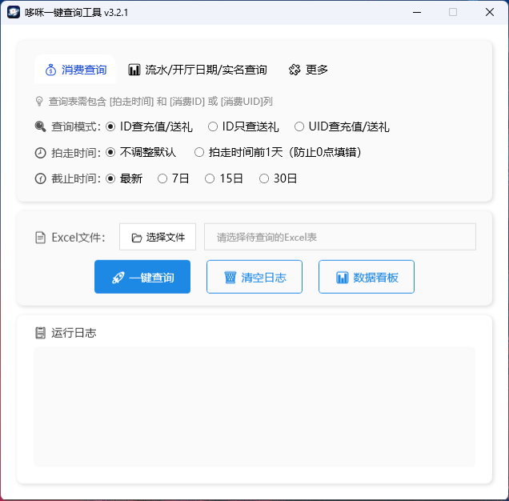

# 软件介绍

`DmPayQuery` 是一个基于 `.NET 10` 的 `WPF` 桌面工具，用于批量查询相关业务数据，并将结果导出为 Excel 文件。

当前支持的主要能力：

- 按 `消费ID` 查询充值 / 送礼金额
- 按 `消费UID` 查询充值 / 送礼金额
- 按 `厅ID` 查询厅流水与开厅时间
- 按 `主播ID` 查询主播流水与实名信息
- 支持登录缓存、批量处理、结果导出与日志查看

# 构建与发布

本仓库是一个基于 .NET 10 的 WPF 应用程序。使用附带的 `publish.ps1` 脚本可以生成一个体积较小的单文件、框架依赖的发布包，目标机器需要安装 Microsoft .NET Desktop Runtime。

示例：

 - 发布 x64 Release（默认）：
   `./publish.ps1 -Runtime win-x64`

 - 启用 ReadyToRun 发布（可能增大体积）：
   `./publish.ps1 -Runtime win-x64 -EnableReadyToRun`

## 注意事项

- 发布为框架依赖模式（`SelfContained=false`），目标机器需安装对应的 Windows Desktop 运行时。
- 默认启用裁剪（`Trimming`）以减小文件体积；裁剪可能移除运行时所需代码，发布前请充分测试。
- 查询前请确认输入的 Excel 表头与软件要求一致，例如：`消费ID`、`消费UID`、`拍走时间`、`厅ID`、`主播ID` 等。
- 若 `查询结果.xlsx` 已被其他程序打开，可能导致结果无法保存，请先关闭占用该文件的程序后再重试。
- 接口返回结果受服务端数据状态影响，查询失败、无数据或实名信息缺失等情况属于正常业务返回范围。

## 免责声明

- 本工具仅供合法合规的测试学习与数据整理用途使用。
- 使用者应自行确保所处理的数据、账号及操作行为符合所属平台、公司及相关法律法规要求。
- 因接口变更、网络异常、账号权限不足、第三方服务波动或使用环境差异导致的查询失败、结果偏差或数据缺失，项目不承诺绝对准确性与持续可用性。
- 使用本工具所产生的任何直接或间接损失、数据问题或业务影响，由使用者自行承担。

## 软件界面

